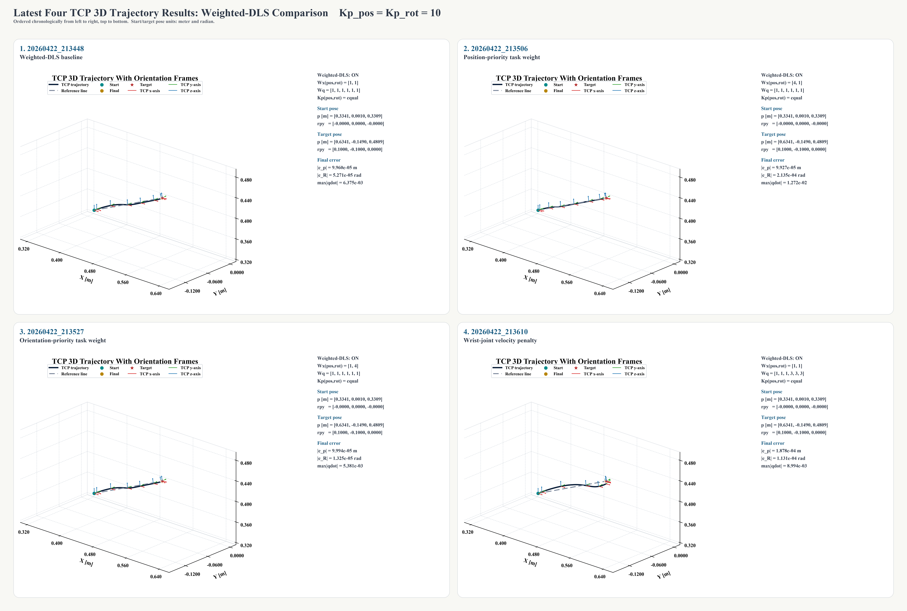
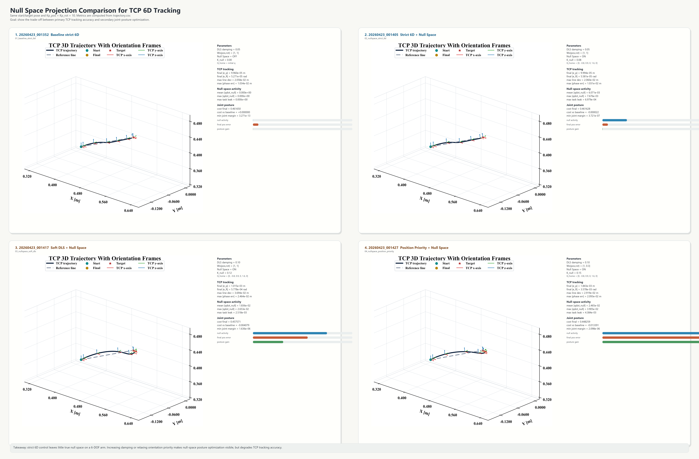
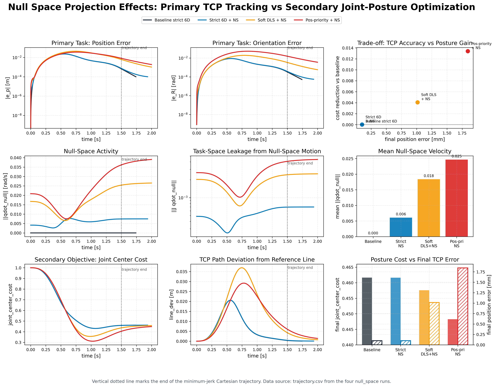

# 机械臂运动学与笛卡尔空间控制

本项目用于机械臂的运动学建模、离线验证和 STM32 端控制部署。当前代码以 6 自由度串联机械臂为主要对象，围绕末端 TCP 位姿控制完成了从 PC 侧算法验证到 MCU 侧工程迁移的闭环链路。

项目当前重点包括：

- 基于 URDF 与 Pinocchio 的正运动学、Jacobian 和 TCP 位姿基准验证。
- 手写 FK/Jacobian，与 Pinocchio 结果批量对齐，用于后续 MCU 部署。
- 位置 DLS、6D DLS、Weighted-DLS 和零空间投影控制律仿真。
- 基于五次时间标定的笛卡尔空间位姿轨迹生成。
- STM32H723 + FreeRTOS 工程中的 6D TCP 闭环控制、遥控器控制、上位机 PTP 位姿命令接口和重力补偿。

## 项目结构

```text
kinematics/
├── src/                         # PC 侧算法模块
│   ├── robot_loader.py           # 加载 URDF / 构造 Pinocchio model
│   ├── fk_jacobian.py            # Pinocchio FK/Jacobian 与数值微分验证
│   ├── manual_fk_jacobian.py     # 手写 FK 与几何 Jacobian
│   ├── tcp_frame.py              # Empty_Link6 -> TCP 变换与 TCP Jacobian
│   ├── pose_error.py             # 3D/6D 位姿误差计算
│   ├── dls.py                    # 位置 DLS 控制律
│   └── task6d_controller.py      # 6D DLS / Weighted-DLS / 零空间控制
├── launch/                       # 离线检查与仿真入口
│   ├── check_fk_jacobian.py
│   ├── compare_manual_fk_jacobian.py
│   ├── batch_compare_manual_vs_pin.py
│   ├── run_dls_demo.py
│   └── run_tcp_pose_6d_demo.py
├── results/                      # 离线仿真生成的 CSV、PNG、SVG、PDF
└── mc02_code/                    # STM32H723 固件工程
    └── Users/
        ├── 0-APL/APL_MecArm/     # 机械臂应用层状态机与控制线程
        ├── 1-MWL/MWL_Kinematics/ # MCU 端 FK/Jacobian/DLS
        ├── 1-MWL/MWL_SO3/        # SO(3) log/exp 与姿态误差
        ├── 1-MWL/MWL_Trajectory/ # 笛卡尔位姿轨迹生成
        └── 1-MWL/MWL_Matrix/     # MCU 端矩阵/LDLT 求解工具
```

URDF 模型位于项目内的 `mec_arm_model/urdf/mec_arm.urdf`，Python 侧通过 `src/robot_loader.py` 自动加载。

## 控制链路


控制核心是：

```text
twist_target = twist_ff + Kp * pose_error
qdot_primary = J#_wdls * twist_target
qdot = qdot_primary + (I - J#J) * qdot_null
```

其中 `J#_wdls` 由加权阻尼最小二乘构造：

```text
J#_wdls = (J^T Wx J + lambda^2 Wq)^-1 J^T Wx
```

MCU 侧没有显式构造投影矩阵，而是使用等价形式：

```text
qdot = qdot_primary + qdot_null_raw - J# * (J * qdot_null_raw)
```

这样可以减少矩阵构造和内存占用，更适合嵌入式部署。

## 当前进度

截至 2026-04-26，项目已经完成以下内容：

- `src/fk_jacobian.py`：完成 Pinocchio FK、Frame Jacobian 和数值微分验证。
- `src/manual_fk_jacobian.py`：完成基于关节链参数的手写正运动学和 3D 位置 Jacobian。
- `launch/batch_compare_manual_vs_pin.py`：完成 200 组随机姿态批量对比，位置、姿态和 Jacobian 误差均在浮点数值误差范围内。
- `src/tcp_frame.py`：完成 TCP 固定偏置、TCP 位姿计算和 6D TCP Jacobian 推导。
- `src/task6d_controller.py`：完成 6D DLS、Weighted-DLS、任务权重、关节权重、速度限幅和零空间投影。
- `launch/run_tcp_pose_6d_demo.py`：完成五次时间标定轨迹、速度前馈、误差统计、Jacobian 质量指标、关节限位指标与结果导出。
- `mc02_code/Users/1-MWL/MWL_Kinematics`：已迁移 MCU 端 FK、TCP 6D Jacobian、3D DLS、6D Weighted-DLS 和零空间软投影。
- `mc02_code/Users/1-MWL/MWL_SO3`：已实现 SO(3) `Log3`、`Exp3` 和世界坐标系姿态误差。
- `mc02_code/Users/1-MWL/MWL_Trajectory`：已实现笛卡尔空间最小 jerk 位姿轨迹和前馈 twist。
- `mc02_code/Users/0-APL/APL_MecArm`：已接入 1 ms 控制线程、遥控器笛卡尔 twist 模式、上位机 PTP 目标位姿接口、关节限幅和重力补偿。

## 验证结果

手写 FK/Jacobian 与 Pinocchio 的批量对比结果保存在：

```text
results/batch_compare_manual_vs_pin/20260419_212014/summary.json
```

关键统计如下：

| 指标 | 结果 |
| --- | ---: |
| 随机样本数 | 200 |
| FK 位置误差均值 | 2.84e-16 m |
| FK 位置误差最大值 | 5.69e-16 m |
| 姿态矩阵误差均值 | 1.23e-15 |
| 姿态矩阵误差最大值 | 1.92e-15 |
| 位置 Jacobian 误差均值 | 5.40e-16 |
| 位置 Jacobian 误差最大值 | 1.06e-15 |

最近一次 6D TCP 位姿控制仿真结果位于：

```text
results/tcp_pose_6d_demo/null_space/20260423_001427/trajectory.csv
```

该次仿真共 2000 步，末端位置误差约 `1.84e-3 m`，姿态误差约 `3.58e-3 rad`，最大关节速度约 `1.57 rad/s`。结果目录中同时导出了关节位置曲线、TCP 三维轨迹、位姿误差曲线和零空间投影指标图。

## 快速运行

建议在 Python 3.11 环境中运行 PC 侧验证脚本，并安装：

```bash
pip install numpy pin matplotlib
```

常用入口：

```bash
# 检查 Pinocchio FK/Jacobian 与数值微分
python launch/check_fk_jacobian.py

# 对比手写 FK/Jacobian 与 Pinocchio
python launch/compare_manual_fk_jacobian.py

# 批量随机姿态验证手写 FK/Jacobian
python launch/batch_compare_manual_vs_pin.py

# 运行 3D 位置 DLS 闭环 demo
python launch/run_dls_demo.py

# 运行 TCP 6D 位姿控制、Weighted-DLS、零空间投影 demo
python launch/run_tcp_pose_6d_demo.py
```

脚本运行后会在 `results/` 下按时间戳生成结果目录。

## STM32 工程说明

`mc02_code/` 是面向 STM32H723 的固件工程，主要依赖 STM32CubeMX、FreeRTOS、CMSIS-DSP、FDCAN、UART 和电机驱动封装。

关键模块：

- `APL_MecArm`：机械臂应用层状态机，负责模式切换、反馈更新、目标生成和命令下发。
- `MWL_Kinematics`：嵌入式运动学库，提供 TCP FK、6D Jacobian、Weighted-DLS 和零空间投影。
- `MWL_SO3`：姿态误差和 SO(3) 指数/对数映射。
- `MWL_Trajectory`：笛卡尔位姿 PTP 轨迹生成。
- `MWL_Matrix`：固定尺寸矩阵运算和 3x3 / 6x6 LDLT 求解器。
- `HDL_Motor` / `HAL_FDCAN`：电机抽象与 FDCAN 通信。

当前应用层支持的机械臂模式包括：

- 无力模式
- 关节空间控制
- 末端工具关节控制
- 笛卡尔空间 twist 控制
- 笛卡尔空间 PTP 位姿控制
- 重力补偿模式

## 算法效果展示

下面三张图用于展示 Weighted-DLS 与零空间投影优化的离线仿真效果。Weighted-DLS 通过任务空间权重和阻尼项平衡位置、姿态与关节速度；零空间投影在尽量不破坏 TCP 主任务的前提下，引入关节姿态保持和关节限位优化。






